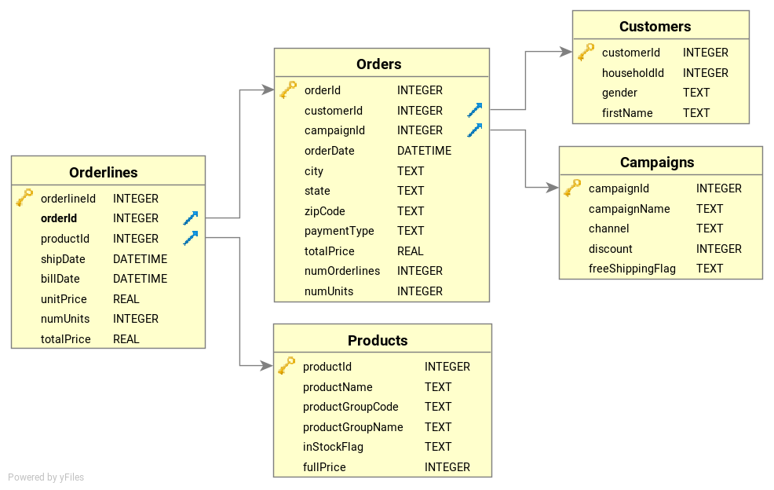

```{r setup, include=FALSE}
knitr::opts_chunk$set(echo = TRUE)
library(dplyr)
library(ggplot2)
library(RSQLite)
library(pander)
```

# Ziel

Das Ziel dieser Dokumentation ist es, Daten einzuführen und den Überblick darüber zu haben.

# Daten 



```{r}
dbh <- dbConnect(SQLite(), dbname="../sql/database.sqlite")
```

## Customers

Diese Tabelle enthält das Geschlecht und den Vornamen jedes Kunden. 

```{r}
df.customers <- dbReadTable(dbh, "Customers")
df.customers %>% slice(1:10) %>% pander()
```

Das Geschlechtes von mehr als 90% der Kunde sind bekannt und 


```{r}
df.customers %>%
    group_by(gender) %>% summarise(anzahl=n()) %>%
    mutate(rate=anzahl/sum(anzahl))
```


```{r}
df.orders <- dbReadTable(dbh, "Orders")
df.orders %>% mutate(orderId=as.character(orderId)) %>%
    slice(1:10) %>% pander()
```


```{r}
str(df.orders)
```
